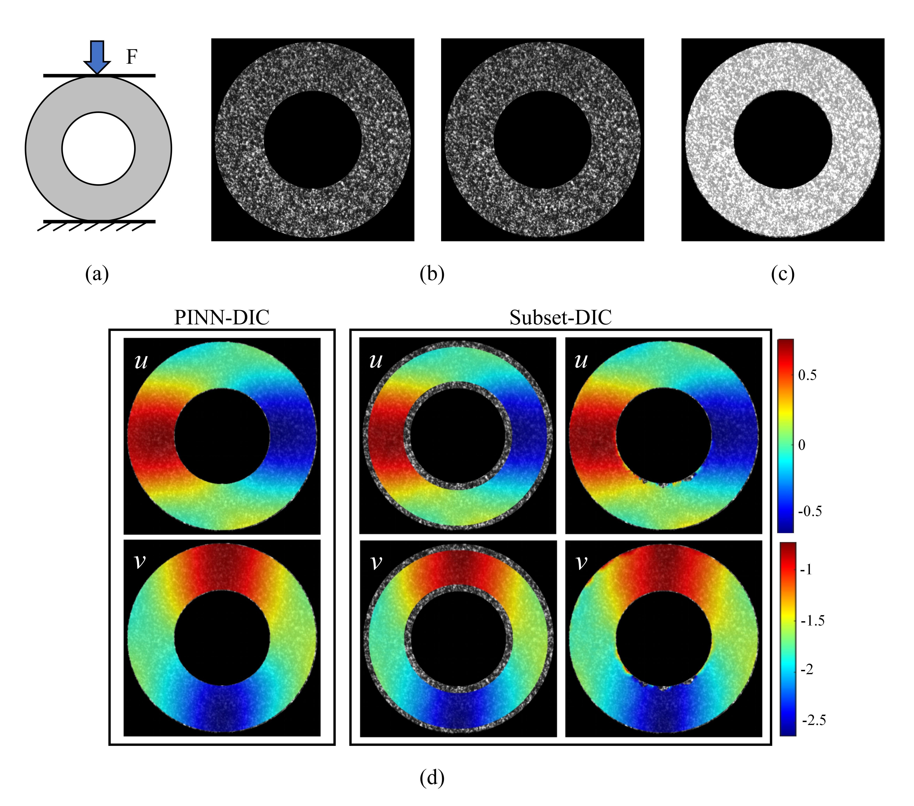

# Computing-Platform

[](LICENSE)
[](https://www.python.org/downloads/)

The PINN-DIC computing platform is a solution for Digital Image Correlation (DIC) problems based on Physics Informed Neural Networks (PINN). This platform aims to provide an efficient and accurate method for image displacement field analysis by combining deep learning techniques with physical principles.

## Table of Contents

- [Installation](#installation)
- [Usage](#usage)
- [Features](#features)
- [Project Structure](#project-structure)
- [Configuration](#configuration)
- [Examples](#examples)
- [License](#license)
- [Contact](#contact)

## Installation

### Prerequisites

- Python 3.7 or higher
- Required packages are listed in `requirements.txt`.

### Clone the Repository

```bash
git clone https://github.com/lbd-hfut/Computing-Platform.git
cd Computing-Platform
```

## Usage

To use this project, follow the instructions below.

### Prepare the Dataset to be solved

- Please place the reference image, deformed image, and ROI image into any subfolder within the `data` directory. The ROI image can be created by running the `utils/select_roi.py` script, which allows users to manually select the ROI in either a circular or rectangular shape based on their needs. For more complex ROI shapes, you can use the built-in Windows `mspaint` software. In MSPaint, paint the ROI area white and cover any obvious white spots in the background with black.


- Please name the reference image, deformed image, and ROI image in the following format:
  * Reference image: The file name starts with the letter `"r"` followed by a number (e.g. `r0000.bmp`).
  * Deformed image: The file name starts with the letter `"d"` followed by a number (e.g. `d0001.bmp, d0002.bmp`).
  * ROI image: The file name starts with `"mask"` followed by a number (e.g. `mask0003.bmp`).

The numbers in the file name should be in order, and the file extension can be .bmp, .JPG, or .png.


### Running the Application

First, select the deep learning parameters in the `configs/config.py` file, then you can run the main application script with the following command:

```bash
python train.py
python plot_fig.py
```

Then a subfolder named "`to matlab`" will be generated in the `image data folder` to store the solved displacement field data and the corresponding displacement field cloud map. These files can be directly imported into MATLAB for further processing and analysis.

## Features

- **Physics-Informed Neural Networks (PINN) Integration**: Our method, PINN-DIC, leverages Physics-Informed Neural Networks to solve the Digital Image Correlation (DIC) problem, combining the strengths of deep learning with the principles of physics.
  
- **No Manual Parameter Setting**: Unlike traditional Subset-DIC, our approach does not require manual parameter tuning, making the process more efficient and user-friendly.

- **Point-by-Point Full-Field Solution**: The PINN-DIC method solves the displacement field for the entire image domain point-by-point, providing a comprehensive analysis of the deformation field.

- **High Accuracy in Non-Uniform Field Measurements**: Our method achieves higher accuracy, particularly in scenarios involving non-uniform deformation fields, making it suitable for complex experimental setups.

- **Precise Handling of Irregular Boundaries**: The PINN-DIC method excels in solving images with irregular boundaries, offering high precision in boundary deformation measurements.

- **No Need for Training Datasets**: Unlike supervised learning DIC methods, PINN-DIC does not require pre-existing datasets for training, allowing for immediate application to a wide range of problems.

- **Lightweight Neural Network Architecture**: The method uses a simple fully connected neural network, which is more lightweight than those used in unsupervised learning DIC, leading to faster computations and higher accuracy.

- **Ease of Integration**: The PINN-DIC method is designed to be easily integrated with other numerical inversion techniques, enhancing its versatility and applicability in various fields.

## Project Structure

```bash
Computing-Platform/
├── configs/             # Configuration files for the project
├── data/                # Data and scripts for data processing
├── docs/                # Documentation and related resources
├── demos/               # Demo scripts showcasing example usage
├── layers/              # Custom layers and loss functions
├── logs/                # Logging output and training logs
├── utils/               # Utility scripts and helper functions
├── weights/             # Model weights and checkpoints
├── LICENSE              # License file for the project
├── README.md            # Project overview and usage instructions
├── requirements.txt     # List of Python dependencies
├── train.py             # Script to train the model and solve displacement
└── plot_fig.py          # Script to plot and save displacement figures
```

## Configuration

Before starting the solution, the user needs to set the solution-related parameters in advance.
``` python
config = {
    "checkpoint_path": "./weights/checkpoint/",   # Path where model checkpoints are saved
    "model_path": "./weights/models/",            # Path where the trained model is saved
    "data_path": './data/train/',                 # Path to the training data
    "warm_lr": 0.001,                             # Learning rate for the warm-up phase
    "train_lr": 0.0005,                           # Learning rate for the training phase
    "max_iter": 20,                               # Maximum number of iterations
    "weight_decay": 3e-2,                         # Weight decay to prevent overfitting
    "layers": [2, 50, 50, 50, 2],                 # Configuration of the neural network layers
    "scale": [[1,10]]*5,                          # Scaling factor for the network layers
    "warm_adam_epoch": 200,                       # Number of epochs for Adam optimizer during warm-up
    "warm_bfgs_epoch": 200,                       # Number of epochs for BFGS optimizer during warm-up
    "train_adam_epoch": 200,                      # Number of epochs for Adam optimizer during training
    "train_bfgs_epoch": 200,                      # Number of epochs for BFGS optimizer during training
    "patience_adam": 10,                          # Early stopping patience for Adam optimizer
    "patience_lbfgs": 10,                         # Early stopping patience for L-BFGS optimizer
    "delta_warm_adam": 1,                         # Early stopping loss falling threshold for Adam during warm-up
    "delta_warm_lbfgs": 0.01,                     # Early stopping loss falling threshold for L-BFGS during warm-up
    "delta_train_adam": 0.01,                     # Early stopping loss falling threshold for Adam during training
    "delta_train_lbfgs": 0.005,                   # Early stopping loss falling threshold for L-BFGS during training
    "epoch": 0,                                   # Current training epoch
    "print_feq": 10                               # Frequency of logging during training
}

```

### Parameter Description

The parameters `patience_adam`, `patience_lbfgs`, `delta_warm_adam`, `delta_warm_lbfgs`, `delta_train_adam` and `delta_train_lbfgs` are set to prevent overfitting during the PINN-DIC calculation. During the `warm up` phase, if the absolute change in the loss during the Adam optimization is less than `delta_warm_adam` for `patience_adam` generations in a row, the `Adam` optimization process during the `warm up` phase will be terminated early. The same conditions apply to the `L-BFGS` optimization process during the `warm up` phase, as well as the `Adam` and `L-BFGS` optimization processes during the `train` phase. This avoids continuing training when the loss has stabilized, thus preventing overfitting.

## Examples

### Analysis of Displacement Field in a Diametrically Compressed Circular Ring Using PINN-DIC

The figure below shows the experimental results of using PINN-DIC to analyze the displacement field of a diametrically compressed circular ring specimen. The results are compared with those obtained using two different Subset-DIC boundary handling methods. As illustrated, the PINN-DIC method accurately resolves the displacement field across the entire domain, even for specimens with irregular boundaries. In contrast, the Subset-DIC methods either fail to determine the displacements at boundary points or produce less accurate results.


- **(a)** Specimen loading diagram
- **(b)** Deformed and reference speckle images
- **(c)** Calculation region (ROI)
- **(d)** Comparison of resolved results


## License

This project is licensed under the MIT License. See the `LICENSE` file for more details.

## Contact

Boda Li, School of Ocean and Civil Engineering, Shanghai Jiao Tong University, Shanghai 200240, China.

Email: `leebda_sjtu@sjtu.edu.cn`
