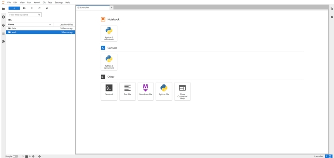
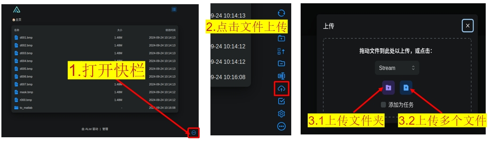
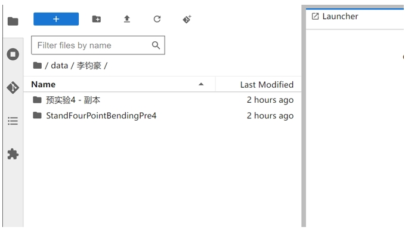
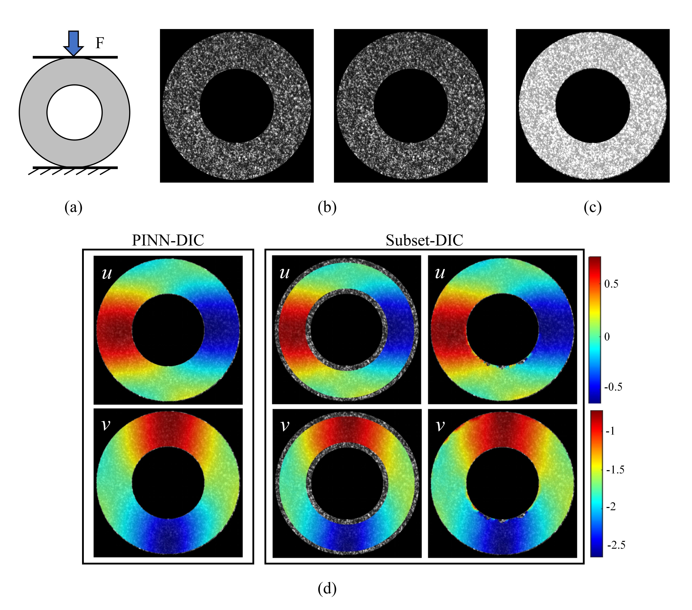
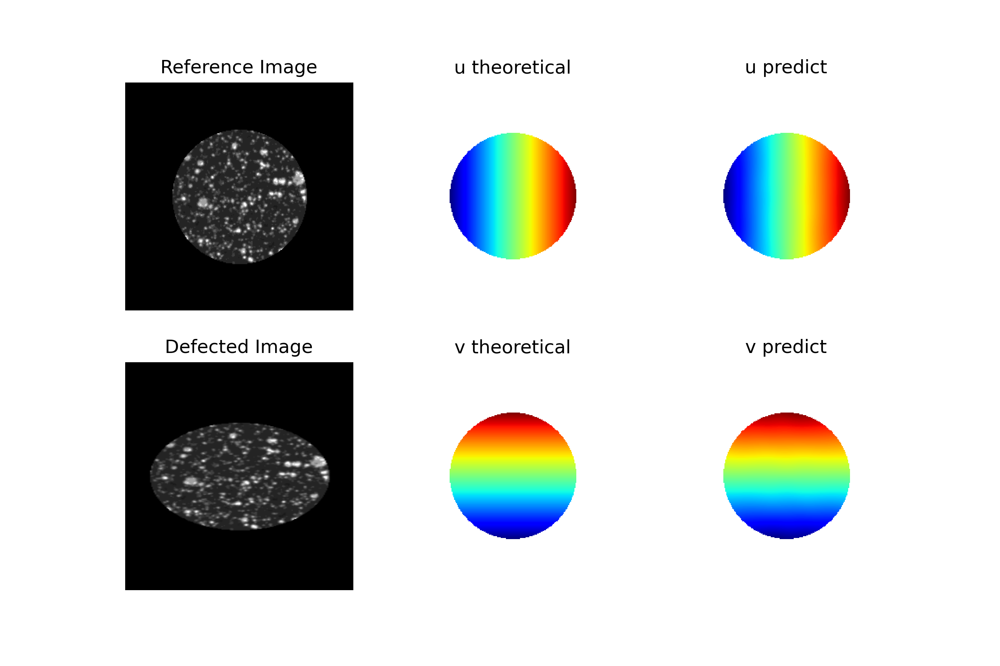

# 计算平台

[](https://www.python.org/downloads/)     [](https://pytorch.org/get-started/locally/)                                                                                               [](https://developer.nvidia.com/cuda-downloads)

PINN-DIC计算平台是基于物理信息神经网络（PINN）的数字图像相关（DIC）问题的解决方案。该平台旨在通过将深度学习技术与物理原理（灰度一致性假设）相结合，为图像位移场分析提供一种高效准确的方法。
### 特点
- **物理信息神经网络（PINN）集成**：我们的PINN-DIC方法利用物理信息神经网络解决数字图像相关（DIC）问题，将深度学习的优势与物理原理相结合。
- **无需手动参数设置**：与传统的子集DIC不同，我们的方法不需要手动调整参数，提升了过程的效率和用户友好性。
- **逐点全场解法**：PINN-DIC方法逐点求解整个图像域的位移场，提供全面的变形场分析。
- **非均匀场测量高精度**：我们的算法在非均匀变形场中表现出更高的准确性，适用于复杂的实验设置。
- **精确处理不规则边界**：PINN-DIC方法在解决具有不规则边界的图像时表现出色，提供高精度的边界变形测量。
- **无需训练数据集**：与监督学习的DIC方法不同，PINN-DIC不需要预先存在的数据集进行训练，可立即应用于各种问题。
- **轻量级神经网络架构**：该方法采用简单的全连接神经网络，相比于无监督学习DIC使用的网络更轻量，计算更快且精度更高。
- **易于集成**：PINN-DIC方法设计易于与其他数值反演技术集成，增强了其在各个领域的适用性。


## 目录

- [前置条件](#前置条件)
- [上传文件](#上传文件)
- [Python工程结构](#Python工程结构)
- [使用说明](#使用说明)
- [参数配置](#参数配置)
- [展示例子](#展示例子)
- [联系我们](#联系我们)

## 前置条件

1. **设备**：使用个人电脑（PC）

2. **网络**：
   - 确保已连接至交大WiFi（SJTU WiFi）或校内有线网络。
   - 若用户在校外，则通过**交大VPN**访问校院网SJTU WiFi，**交大VPN**下载链接 https://net.sjtu.edu.cn/wlfw/VPN.htm 。

3. **浏览器选择**：
- 推荐使用以下浏览器进行网络浏览：
    - **Firefox**
    - **Chrome**
    - **Mecrosoft Edge**
 
4. **登录计算平台**：
- 访问链接 http://111.186.41.148:9090/lab ，即可登录到计算平台，平台界面如下：



## 上传文件

1. **浏览器打开网址：** http://111.186.41.148:7500 

2. **登陆自己的账号：**
    - 例： **用户名**&nbsp;&nbsp;&nbsp;&nbsp;**李袀豪**&nbsp;&nbsp;&nbsp;&nbsp;**密码:**&nbsp;&nbsp; 123456789 
    


3. **上传文件：**：
    用户按下述步骤：
    
    1.打开网页下方的快捷栏
    
    2.点击快捷栏中的文件上传图标
    
    3.选择上传文件夹`左侧紫色图标`或上传多个文件`右侧紫色图标`
    
    
    
    4.上传文件后，可在计算平台的`~/data/李袀豪`文件下查看数据
    
    

## Python工程结构

```bash
Computing-Platform/
├── configs/             # 项目的配置文件
├── docs/                # 文档及相关资源
├── layers/              # 自定义层和损失函数
├── utils/               # 工具脚本和辅助函数
├── weights/             # 模型权重和检查点
├── LICENSE              # 项目的许可证文件
├── README..ipynb        # 项目概述和使用说明
├── requirements.txt     # Python依赖库列表
├── scale_list.py        # 生成位移场的尺度列表
├── train.py             # 训练模型和求解位移的脚本
├── batch_processing.py  # 训练模型和求解位移的批处理脚本，适用于多张图像的处理场景
├── Ldef_processing.py   # 训练模型和求解位移的脚本，适用于大变形的场景
└── plot_fig.py          # 绘制和保存位移图的脚本
```

## 使用说明

要使用计算平台，请按照以下说明进行操作。

### 图像准备和ROI选择指南

- 请按以下格式命名参考图像、变形图像和ROI图像：

    * 参考图像：文件名以字母 `"r"` 开头，后跟一个数字（例如 `r0000.bmp`）。
    * 变形图像：文件名以字母 `"d"` 开头，后跟一个数字（例如 `d0001.bmp`、`d0002.bmp`）。
    * ROI图像：文件名以 `"mask"` 开头，后跟一个数字（例如 `mask0003.bmp`）。

文件名中的数字应按顺序排列，文件扩展名可以为 `.bmp`、`.JPG`、`.tiff` 或 `.png`。我们提供了**图像命名程序**`rename_img.py`和`rename_img.m`帮助用户将参考图和变形图**规范化命名**，程序存放在平台的目录`~/work/test/Computing-Platform/utils`下，用户可以**自主下载**。
    
`rename_img.py`为Python文件，使用操作如下：将文件放到存放图像的文件夹中，图像按名称顺序排列，参考图像在第一张，**在该文件夹下打开终端**，在终端里运行如下代码：`python rename_img.py`

`rename_img.m`为Matlab程序，使用操作如下：将文件放到存放图像的文件夹中，图像按名称顺序排列，参考图像在第一张，在该文件夹下打开Matlab，运行此程序。

- ROI图像可以通过运行`utils/select_roi.py`脚本来创建，该脚本允许用户根据需要手动选择圆形或矩形的ROI。对于**更复杂的ROI形状**，您可以使用**Windows**自带的`mspaint软件`。在**mspaint**中，将ROI区域涂成白色，并用黑色覆盖背景中的明显白点。[视频链接：通过mspaint画ROI](https://www.bilibili.com/video/BV1vzseerEwu/?vd_source=198bed16e5eae2ab74b19efc8f9943ab)


### 运行计算平台指南

**步骤**

1. 用户上传完图像后，打开`~/work/test/Computing-Platform/configs/config.py`文件，在文件中填写数据地址(采用**相对路径**)

2. 打开计算平台的终端terminal，输入下列命令行：

```bash
# 1. 把平台切换到工作目录下
cd ~/work/Computing-Platform/

# 2. 运行 scale_list.py，获取该算例中最大位移尺度
尺度列表保存在图像文件夹下的子文件夹 scale_information
python scale_list.py

# 3. 运行 train.py，计算位移场
python train.py

# 4. 如果处理大批量的变形图，可运行批处理程序进行位移场计算
python batch_processing.py

# 5. 如果处理大变形的场景，运行专门处理大变形的程序进行计算
python Ldef_processing.py

# 6. 运行 plot_fig.py，将计算得到的位移场结果保存到用户传入图像的
# 文件夹下的子文件夹 to_matlab，同时可视化的位移云图也保存在该文件夹下
python plot_fig.py

# 7. 命令行可以顺序处理，因此上述命令行可以合并
python scale_list.py && python train.py && python plot_fig.py
python scale_list.py && python batch_processing.py && python plot_fig.py
python scale_list.py && python Ldef_processing.py && python plot_fig.py
```


## 参数配置

在开始求解之前，用户需要提前设置求解相关参数。一般情况下，用户只需修改“`data_path`”，即上传的图像所在的相对路径。
``` python
config = {
    "checkpoint_path": "./weights/checkpoint/",   # 模型检查点保存路径
    "model_path": "./weights/models/",             # 训练后模型保存路径
    "data_path": './data/train1/',                 # 训练数据路径
    "warm_lr": 0.001,                              # 热身阶段的学习率
    "train_lr": 0.0005,                            # 训练阶段的学习率
    "max_iter": 20,                                # 最大迭代次数
    "weight_decay": 3e-2,                          # 权重衰减以防止过拟合
    "layers": [2, 50, 50, 50, 2],                  # 神经网络层配置
    "warm_adam_epoch": 200,                        # 热身阶段Adam优化器的迭代次数
    "warm_bfgs_epoch": 200,                        # 热身阶段BFGS优化器的迭代次数
    "train_adam_epoch": 200,                       # 训练阶段Adam优化器的迭代次数
    "train_bfgs_epoch": 200,                       # 训练阶段BFGS优化器的迭代次数
    "patience_adam": 20,                           # Adam优化器的早停耐心
    "patience_lbfgs": 20,                          # L-BFGS优化器的早停耐心
    "delta_warm_adam": 0.05,                       # 热身阶段Adam的早停损失变化阈值
    "delta_warm_lbfgs": 0.03,                      # 热身阶段L-BFGS的早停损失变化阈值
    "delta_train_adam": 0.01,                      # 训练阶段Adam的早停损失变化阈值
    "delta_train_lbfgs": 0.005,                    # 训练阶段L-BFGS的早停损失变化阈值
    "epoch": 0,                                    # 当前训练轮次
    "print_feq": 10,                               # 训练期间日志记录频率
    "Batchframes": 5                               # 每批次处理的帧数
}

```

### 调参指导以及参数的说明

当用户按照`使用说明`完成计算后，发现求解位移场与自己预期的位移场差距十分大的时候，此时是神经网络发生欠拟合的情况，发生此种的现象原因：学习率调的过大，导致神经网络训练并没有达到收敛，则应该采用更小的学习率：把`warm_lr`和`train_lr`调小10倍测试一下，同时保证`warm_lr >= 2 * train_lr`

当计算完成后，发现求解位移场与自己预期的位移场差距相似，但一些空间细节并未有求解出来，那么可以增加训练求解的代数：`warm_adam_epoch`、`warm_bfgs_epoch`、`train_adam_epoch`、`patience_lbfgs`,同时调节与过拟合相关的参数，防止训练提前终止

与过拟合相关的参数 `patience_adam`、`patience_lbfgs`、`delta_warm_adam`、`delta_warm_lbfgs`、`delta_train_adam` 和 `delta_train_lbfgs` 被设置用来防止在 PINN-DIC 计算过程中出现过拟合。在 `热身` 阶段，如果 Adam 优化过程中的损失绝对变化在 `patience_adam` 次连续迭代中小于 阈值`delta_warm_adam`，则 `热身` 阶段的 Adam 优化过程将提前终止。相同的条件也适用于 `热身` 阶段的 L-BFGS 优化过程，以及 `训练` 阶段的 Adam 和 L-BFGS 优化过程。这避免了在损失稳定时继续训练，从而防止了过拟合。

当结果出现过拟合时(求解的位移场肉眼可见的不光滑)，我们需要减小`patience`增加阈值`delta`,以及值得注意的是，四个阶段的阈值需要满足应依次减小的关系；当求解结果的一些空间细节还未优化求解出来，需要增加`patience`减小阈值`delta`

## 展示例子

### 利用PINN-DIC分析径向压缩圆环中的位移场

下图展示了使用 PINN-DIC 分析直径压缩的圆环试样位移场的实验结果。结果与采用两种不同 Subset-DIC 边界处理方法获得的结果进行了比较。如图所示，PINN-DIC 方法能够准确解析整个区域的位移场，即便是对于边界不规则的试样。而 Subset-DIC 方法要么无法确定边界点的位移，要么产生较不准确的结果。



**(a)** 试样加载示意图； **(b)** 变形和参考散斑图像； **(c)** 计算区域 (ROI)； **(d)** 解析结果的比较。


### 利用PINN-DIC分析径向压缩圆盘中发生大变形的位移场

利用 PINN-DIC 分析径向压缩圆盘中发生大变形的位移场，并对比了理论位移场与预测位移场。实验结果表明，PINN-DIC 方法能够有效捕捉圆盘在大变形条件下的复杂位移分布。在不同加载条件下，理论位移场与预测位移场的比较显示出良好的一致性，验证了 PINN-DIC 方法的准确性和可靠性。




## 联系我们

马少鹏, 船舶海洋与建筑工程学院, 上海交通大学

电子邮件：mashaopeng@sjtu.edu.cn

个人主页：https://www.researchgate.net/profile/Shaopeng-Ma
